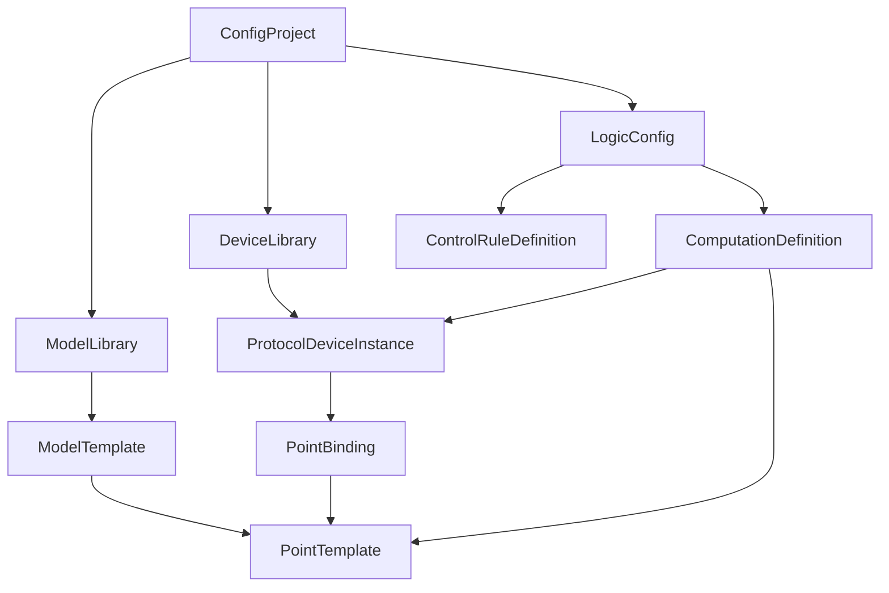

## 目标

本文档用于定义 CEPB 配置上位机首个正式设计版本，覆盖以下三部分：

1. 统一内部数据模型
2. 页面结构与交互分层
3. 导入导出规则

设计目标不是直接复刻现有 JSON 文件，而是建立一套稳定的内部模型，使工具既能兼容当前的文件格式，也能为后续的 645、Modbus、LogicCenter 运算配置扩展预留空间。

## 背景与现状

### 设备侧三层架构

设备内当前可以抽象为三层：

1. 北向 APP
2. 中间件 APP
3. 南向 APP

典型组合为：

- ServiceChannel：北向即插即用协议 APP
- cepLogicCenter：逻辑中心 APP
- cepiec104：南向 104 协议 APP

### 当前关键配置文件

以常见 104 方案为例，当前核心配置文件分为三类：

1. 南向模型文件
   - 目录：cepiec104/model
   - 文件示例：model_数采装置.json、model_开关.json
2. 南向设备文件
   - 目录：cepiec104/dev
   - 文件示例：device-xxx.json
3. LogicCenter 配置文件
   - 目录：cepLogicCenter/etc
   - 文件示例：LogicCenter_Config.json

### 已确认的结构事实

1. 模型文件负责定义设备类型模板。
2. 设备文件负责实例化模型，并填写协议相关参数和点位映射。
3. LogicCenter 配置基于 DeviceId 和 dataRef 做计算、控制变换和高级功能。
4. 设备文件中的 Model 字段引用模型 profile.model。
5. 运行时 dataRef 不是自由文本，而是由模型点位字段组合生成。
6. 模型文件内的 services 固定为三类：遥测、遥信、控制。
7. 遥控和遥调都归入控制 service，它们的差异主要体现在数据类型和控制语义上，而不是 service 层级。
8. cepiec104 的 ipb 已属于历史遗留参数，后续不再作为有效配置项参与建模。

当前已确认的 dataRef 生成规则为：

```text
dataRef = LDname + "." + LNtype + "." + LNinst + "." + DOname
```

例如：

```text
PROT.SlrInvMMXU.1.ActPwr
PROT.SlrInvAlmGGIO.1.Cbr_Pos
```

这意味着配置工具必须以“模型点模板”为主源，设备实例只允许引用模型里已定义的点位，不应让用户手工创建任意 dataRef。

## 设计边界

### 首期范围

首期配置工具聚焦以下能力：

1. 模型模板管理
2. 104 设备实例配置
3. 现有文件导入
4. 稳定导出当前现场可用 JSON
5. 基础校验、差异预览、冲突提示

### 暂不纳入首期的能力

以下能力不作为首期交付，但内部模型必须预留：

1. LogicCenter computation_points 可视化编辑
2. LogicCenter control_rules 编辑
3. 645 设备实例编辑
4. Modbus 设备实例编辑
5. 设备在线下发、热更新、远端部署编排

## 设计原则

### 原则一：内部模型先于文件格式

工具内部以统一对象模型为准，导入负责解析历史文件，导出负责适配目标 APP 所需格式。内部对象不应被当前某一个 APP 的字段命名绑死。

### 原则二：模型和设备严格分层

模型定义“设备类型有哪些点”，设备定义“这台设备如何通信、每个点在该协议中如何映射”。

对于当前南向模型文件，services 层不做开放式扩展，而是固定为三类业务分组：遥测、遥信、控制。
其中遥控和遥调统一归入“控制”组，若需要继续区分，应在点级属性中表达，而不是新增 service。

### 原则三：协议差异下沉到适配层

104、645、Modbus 的差异主要体现在：

1. 设备级通信参数不同
2. 点级地址/寄存器映射字段不同
3. 点级附加属性不同

因此页面结构和内部模型应当保持“通用骨架 + 协议适配扩展”的方式。

### 原则四：所有引用关系可回溯

用户在任意界面上看到一个点时，必须能够明确知道：

1. 它属于哪个模型
2. 它生成的标准 dataRef 是什么
3. 哪些设备实例引用了它
4. 将来 LogicCenter 是否依赖它

### 原则五：导入导出尽量无损

工具不仅要生成新文件，还要能稳定接管已有项目，因此必须尽量保留历史字段、文件名和字段顺序的可预期性。

## 统一内部数据模型

## 总体对象关系



## 核心对象定义

### 1. ConfigProject

表示一个完整工程视图，用于承载某一套设备配置数据。

建议字段：

```json
{
  "projectId": "uuid",
  "projectName": "示例工程",
  "sourceRoot": "/home/cepgateway/app",
  "northApp": "ServiceChannel",
  "logicApp": "cepLogicCenter",
  "southApps": ["cepiec104"],
  "models": [],
  "devices": [],
  "logic": {},
  "metadata": {}
}
```

说明：

1. ConfigProject 是工具内部概念，不要求导出为某个单一 JSON。
2. 一个工程允许同时存在多个南向 APP。
3. 同一个模型可以被多个设备实例复用。

### 2. ModelTemplate

表示一个可复用的设备类型模板，对应当前的 xxxmodel.json。

建议字段：

```json
{
  "modelId": "model_开关",
  "name": "model_开关",
  "displayName": "开关",
  "deviceType": "开关",
  "manufacturerId": "",
  "manufacturerDesc": "",
  "version": "1.0",
  "schema": "",
  "services": [],
  "pointIndex": {},
  "extensions": {},
  "source": {}
}
```

约束：

1. modelId 对应现场文件里的 profile.model。
2. name 允许与 modelId 相同，displayName 用于界面展示。
3. pointIndex 是工具内部索引，用于快速按 dataRef 查找点位。
4. source 用于记录原始文件路径、文件名、导入时间、未知字段等。

### 3. ServiceTemplate

由于现有模型文件采用 services -> DOs 结构，内部仍保留 service 这一层。

建议字段：

```json
{
  "serviceId": "measurement",
  "name": "遥测",
  "serviceType": "measurement",
  "points": []
}
```

说明：

1. 当前南向模型文件中的 services 在工具内固定为三组：measurement、status、control。
2. 建议固定顺序为：遥测、遥信、控制。
3. 遥控和遥调都归入 control 组，不再单独拆成第四组。
4. 若导入的历史文件中缺少某一组，内部模型自动补空组，导出时按固定三组输出。

### 4. PointTemplate

表示模型中的一个标准点模板，是后续设备实例绑定的主锚点。

建议字段：

```json
{
  "pointId": "uuid",
  "category": "measurement",
  "signalType": "yc",
  "name": "ActPwr",
  "description": "并网点开关有功功率",
  "ldName": "PROT",
  "lnType": "SlrInvMMXU",
  "lnInst": "1",
  "doName": "ActPwr",
  "doType": "CMV",
  "dataType": "Float",
  "unit": "kW",
  "deadZoneType": "",
  "deadZoneValue": "",
  "min": "",
  "max": "",
  "step": "",
  "maxLength": "",
  "dataRef": "PROT.SlrInvMMXU.1.ActPwr",
  "tags": [],
  "extensions": {},
  "source": {}
}
```

字段说明：

1. category 是工具内部标准分类，固定对应三类 service：measurement、status、control。
2. signalType 用于界面和协议映射层做业务归类，首期建议值收敛为 yc、yx、ctrl；若控制点需要区分遥控或遥调，则通过附加控制语义字段表达。
3. dataRef 为内部标准主键之一，导入时由四段字段重建，编辑时自动生成，不允许手填。

### 5. PointCategory 设计

现有模型文件在业务上固定对应三类点：遥测、遥信、控制。首期建议内部 category 与 service 语义保持一致：

| category | signalType | 含义 |
|----------|------------|------|
| measurement | yc | 遥测量 |
| status | yx | 遥信量 |
| control | ctrl | 控制点，遥控和遥调统一归入控制 |

分类策略：

1. 导入旧模型时，优先按其所在的 service 分组确定 category。
2. control 组内若需区分遥控和遥调，再根据 DOtype、数据类型和命名习惯补充控制语义。
3. 无法识别时默认归类为 measurement 或 status，并标记为“待确认”。
4. 用户在模型编辑器中可以人工修正 category 和控制语义。
5. 导出到当前现场模型文件时，按固定三组 service 输出，不强制写回额外 category 字段，以保持兼容。

### 6. ProtocolDeviceInstance

表示某个南向协议 APP 下的一台设备实例，对应当前的 xxxdev.json。

建议字段：

```json
{
  "deviceUid": "uuid",
  "appType": "cepiec104",
  "protocol": "iec104",
  "deviceId": "SWITCH_661590419687400",
  "deviceDesc": "并网点开关",
  "modelId": "model_开关",
  "transport": {},
  "bindings": [],
  "extensions": {},
  "source": {}
}
```

字段说明：

1. deviceUid 是内部唯一标识，永不暴露给现场 APP。
2. deviceId 对应现场 DeviceId。
3. modelId 必须引用 ModelTemplate.modelId。
4. transport 表示设备级通信参数，由协议适配器定义。
5. bindings 表示模型点到协议点位地址的映射。

### 7. DeviceTransportConfig

不同协议下 transport 结构不同。首期先定义通用头和 104 专用部分。

通用建议字段：

```json
{
  "primaryAddress": "",
  "ip": "",
  "port": "",
  "channel": "",
  "stationAddress": "",
  "serial": {},
  "protocolOptions": {}
}
```

104 当前可映射字段：

| 内部字段 | 现场字段 |
|----------|----------|
| stationAddress | addr |
| ip | ipa |
| port | port |

说明：

1. 对 104 而言，ipb 已确认为无效历史参数，不进入内部有效 transport 模型。
2. transport 不应直接只保留 ipa、addr 这类历史命名。
3. 若导入历史文件包含 ipb，保留到 source 或 rawExtra 中，仅用于兼容回写或审计，不参与业务逻辑。

### 8. PointBinding

表示一个模型点在某台设备实例中的协议映射结果。

建议字段：

```json
{
  "bindingId": "uuid",
  "pointRef": "model_开关#PROT.SlrInvMMXU.1.ActPwr",
  "dataRef": "PROT.SlrInvMMXU.1.ActPwr",
  "descriptionOverride": "并网点开关有功功率",
  "enabled": true,
  "protocolMapping": {
    "address": "16389"
  },
  "initValue": "",
  "selfSignalFlag": "",
  "qualityRule": {},
  "extensions": {},
  "source": {}
}
```

字段说明：

1. pointRef 用于指向模型点，格式建议为 modelId#dataRef。
2. descriptionOverride 允许设备实例覆盖描述，但默认继承模型描述。
3. protocolMapping 是协议适配层扩展区。
4. 104 首期主要用到 address，即当前文件里的 dataIndex。

### 9. LogicConfig

虽然 LogicCenter 编辑不纳入首期，但统一内部模型必须预留逻辑配置容器。

建议字段：

```json
{
  "computations": [],
  "controlRules": [],
  "agcAvc": {},
  "onlineStatusLinks": {},
  "extensions": {},
  "source": {}
}
```

### 10. ComputationDefinition

对应 LogicCenter_Config.json 中 computation_points 的内部对象。

建议字段：

```json
{
  "computationId": "uuid",
  "targetDeviceId": "999",
  "targetDataRef": "PROT.SlrInvMMXU.1.TotalP",
  "description": "全站数采装置输出总有功功率",
  "formula": "{1}+{2}",
  "dropOperands": false,
  "operands": [
    {
      "deviceId": "1",
      "dataRef": "PROT.SlrInvMMXU.1.ActPwr"
    }
  ]
}
```

说明：

1. 当前 LogicCenter 使用 DeviceId + dataRef 作为关键引用锚点。
2. 工具内部应统一使用小写语义字段，再由导出适配器转换为现场格式。

## 统一主键与索引规则

为保证全局引用稳定，建议采用以下主键规则：

1. 模型主键：modelId
2. 模型点主键：modelId#dataRef
3. 设备主键：protocol@appType#deviceId
4. 设备绑定主键：deviceUid#dataRef
5. LogicCenter 操作数主键：deviceId#dataRef

索引建议：

1. 按 modelId 查询模型
2. 按 dataRef 查询模型点
3. 按 deviceId 查询设备
4. 按 modelId 查询设备列表
5. 按 deviceId#dataRef 查询所有逻辑依赖

## 内部模型到现有文件的映射

### 模型文件映射

当前模型文件主要可映射为：

```json
{
  "profile": {
    "devType": "开关",
    "manufacturerDesc": "",
    "manufacturerId": "",
    "model": "model_开关",
    "modelDesc": "开关",
    "version": "1.0"
  },
  "schema": "",
  "services": [
    {
      "DOs": []
    },
    {
      "DOs": []
    },
    {
      "DOs": []
    }
  ]
}
```

映射规则：

1. ModelTemplate.modelId -> profile.model
2. ModelTemplate.deviceType -> profile.devType
3. ModelTemplate.displayName -> profile.modelDesc
4. services 固定映射为遥测、遥信、控制三组。
5. PointTemplate 四段字段 -> 对应 service 组下的 DOs 单项

### 104 设备文件映射

当前 104 设备文件主要可映射为：

```json
{
  "DeviceDesc": "...",
  "DeviceId": "...",
  "Model": "model_开关",
  "addr": "109",
  "ipa": "192.168.0.16",
  "meas_points": [],
  "port": "2404"
}
```

说明：历史文件可能仍带有 ipb，但设计上视其为废弃兼容字段。

映射规则：

1. deviceDesc -> DeviceDesc
2. deviceId -> DeviceId
3. modelId -> Model
4. transport.stationAddress -> addr
5. transport.ip -> ipa
6. transport.port -> port
7. bindings -> meas_points

兼容规则：

1. 导入时若存在 ipb，则写入 source.rawExtra.ipb。
2. 导出时默认不再生成 ipb。
3. 如现场某旧版本仍要求保留该字段，可通过兼容导出开关输出空字符串 ipb。

其中 meas_points 每项映射规则：

1. PointBinding.protocolMapping.address -> dataIndex
2. PointBinding.dataRef -> dataRef
3. PointBinding.descriptionOverride 或点描述 -> description
4. PointBinding.selfSignalFlag -> self_sig_flag
5. PointBinding.initValue -> init_value

## 页面结构设计

## 整体导航结构

建议首期采用左侧导航 + 右侧工作区的桌面应用结构。

```text
配置工程
├─ 工程总览
├─ 模型库
│  ├─ 模型列表
│  └─ 模型编辑器
├─ 设备库
│  ├─ 设备列表
│  └─ 104 设备编辑器
├─ 导入导出中心
├─ 校验中心
└─ 预留：LogicCenter
```

## 页面一：工程总览

目标：提供当前工程的全局可见性。

建议展示内容：

1. 当前工程名称
2. 设备侧根路径或连接目标
3. 模型数量
4. 设备数量
5. 按协议统计的设备数
6. 校验错误数和警告数
7. 最近导入和导出记录

建议操作：

1. 新建工程
2. 打开工程
3. 从现场目录导入
4. 导出到本地目录
5. 运行全量校验

## 页面二：模型列表

目标：管理模型模板集合。

表格字段建议：

1. 模型名称
2. 设备类型
3. 展示名称
4. 点位总数
5. 遥测数
6. 遥信数
7. 控制数
8. 被引用设备数
9. 来源文件

建议操作：

1. 新建模型
2. 复制模型
3. 导入模型文件
4. 删除模型
5. 打开编辑器
6. 查看引用设备

## 页面三：模型编辑器

这是首期最核心的页面。

建议布局：

1. 顶部：模型基础信息表单
2. 中部左侧：点位分类树或筛选器
3. 中部右侧：点位表格
4. 底部：点位详情编辑区或侧边抽屉

模型基础信息字段：

1. modelId
2. 展示名称
3. 设备类型
4. 厂家 ID
5. 厂家描述
6. 版本
7. schema

点位表格字段建议：

1. 类别
2. 点名
3. 描述
4. LDname
5. LNtype
6. LNinst
7. DOname
8. dataRef 预览
9. 数据类型
10. 单位
11. 是否被设备引用

建议交互：

1. 新增点位
2. 批量新增点位
3. 复制点位
4. 删除点位
5. 批量改前缀/后缀
6. Excel 粘贴导入
7. 自动生成 dataRef 并实时校验冲突
8. 根据 category 筛选
9. 根据关键字搜索

首期必须内建的校验：

1. 同一模型内 dataRef 唯一
2. 点名不能为空
3. LNtype、LNinst、DOname 必填
4. category 与 dataType 的组合合理
5. 已被设备引用的点位删除时给出影响提示

## 页面四：设备列表

目标：展示所有设备实例。

表格字段建议：

1. 协议类型
2. DeviceId
3. DeviceDesc
4. 引用模型
5. 地址或站号
6. IP
7. 端口
8. 已映射点位数
9. 缺失地址点位数
10. 来源文件

建议操作：

1. 新建设备
2. 从模型创建设备
3. 复制设备
4. 删除设备
5. 打开设备编辑器
6. 批量导入设备文件

## 页面五：104 设备编辑器

104 编辑器本质上应当是“模型实例化向导 + 点位地址映射表”。

建议布局：

1. 顶部：设备基础信息与通信参数
2. 中部：按模型自动展开的点位映射表
3. 右侧：点位详情与快捷编辑
4. 底部：校验结果与导出预览

设备基础信息字段：

1. DeviceId
2. DeviceDesc
3. 引用模型
4. 站地址
5. 主 IP
6. 备用 IP
7. 端口

点位映射表字段建议：

1. 启用状态
2. 点位类别
3. dataRef
4. 描述
5. 104 公共地址
6. 初始化值
7. 自保持标志
8. 备注

建议交互：

1. 根据模型自动生成全部绑定项
2. 支持按类别分组查看
3. 支持地址连续填充
4. 支持批量偏移
5. 支持从表格粘贴地址
6. 支持隐藏未启用或未配置点
7. 支持导入已有设备文件并反填

首期必须内建的校验：

1. DeviceId 不能为空
2. Model 必须存在
3. 104 地址不得重复
4. 已启用点必须配置地址
5. IP 和端口格式合法
6. 点位 dataRef 必须存在于引用模型

## 页面六：导入导出中心

目标：将“文件操作”和“业务编辑”解耦。

建议功能：

1. 选择导入来源目录
2. 显示检测到的 APP 目录
3. 显示可导入的模型、设备、LogicCenter 文件
4. 显示导入预览和冲突报告
5. 选择导出目标目录
6. 选择导出范围
7. 预览将覆盖的文件

建议拆成两个标签页：

1. 导入
2. 导出

## 页面七：校验中心

目标：集中管理所有错误与警告。

建议分类：

1. 模型错误
2. 设备错误
3. 逻辑引用错误
4. 文件兼容性警告

每条校验结果应支持：

1. 显示错误级别
2. 显示对象路径
3. 一键跳转到对应编辑页
4. 显示修复建议

## 页面八：预留 LogicCenter 页面

首期可以仅展示只读占位页，内容包括：

1. computation_points 数量
2. control_rules 数量
3. 涉及的虚拟点数量
4. 依赖的设备数量

这样可以让配置工具在结构上完整，同时避免第一期范围过大。

## 典型交互流程

### 流程一：从零创建一个新模型

1. 用户在模型列表点击新建模型。
2. 填写模型基础信息。
3. 在模型编辑器中新增点位。
4. 系统自动生成 dataRef。
5. 系统做唯一性校验。
6. 保存模型。

### 流程二：基于模型创建 104 设备

1. 用户在设备列表点击从模型创建设备。
2. 选择模型。
3. 填写 DeviceId、DeviceDesc、站地址、IP、端口。
4. 系统自动生成全部点位绑定。
5. 用户批量填写或粘贴 104 地址。
6. 系统校验地址冲突。
7. 保存设备。

### 流程三：从现场目录导入现有配置

1. 用户选择现场 app 根目录。
2. 系统扫描 model、dev、etc 目录。
3. 解析现有模型文件。
4. 解析现有设备文件。
5. 解析 LogicCenter_Config.json。
6. 生成内部对象并建立引用关系。
7. 输出导入报告和异常提示。

## 导入规则设计

## 导入源范围

首期支持以下导入源：

1. 单个 model 文件
2. 单个 dev 文件
3. 单个 LogicCenter_Config.json
4. 整个 app 根目录
5. 整个 /home/cepgateway/app 根目录镜像目录

## 导入总体流程

```text
扫描目录
-> 识别 APP 类型
-> 识别文件类别
-> 解析 JSON
-> 标准化字段
-> 构建内部对象
-> 建立引用关系
-> 记录未知字段
-> 输出导入结果
```

## 导入标准化规则

### 1. 字段命名统一

导入时统一转换为工具内部命名，例如：

| 原字段 | 内部字段 |
|--------|----------|
| DeviceId | deviceId |
| DeviceDesc | deviceDesc |
| Model | modelId |
| dataRef | dataRef |
| DataRefer | dataRef |
| addr | stationAddress |
| ipa | ip |

其中 ipb 不映射到内部有效字段，只保留到原始兼容信息中。

### 2. dataRef 重建与比对

对于模型文件：

1. 根据 LDname、LNtype、LNinst、DOname 生成 dataRef。
2. 若历史文件未来引入显式 dataRef 字段，则优先比对一致性。
3. 若生成结果与显式值不一致，导入时给出警告。

### 3. 未知字段保留

任何当前设计未识别的字段，都应放入 source.rawExtra 或 extensions 中保留，以确保后续导出尽量无损。

### 4. 模型分类补全

当历史模型没有 category 信息时：

1. 优先按其所属 service 分组映射为遥测、遥信、控制。
2. control 组内若需区分遥控和遥调，再根据 DOtype、数据类型和命名习惯补充控制语义。
3. 自动分类结果标记为 inferred。
4. 等待用户在 UI 中确认。

### 5. 设备绑定修复

导入设备文件时：

1. 先查找其引用模型。
2. 再按 dataRef 将 meas_points 映射到模型点。
3. 若找不到对应点，保留为 orphan binding。
4. orphan binding 进入校验中心，等待人工处理。

### 6. LogicCenter 引用修复

导入 LogicCenter 配置时：

1. 读取 computation_points、control_rules、agcavc 等区块。
2. 对其中每个 DeviceId#dataRef 建立引用索引。
3. 若目标设备或点位不存在，导入时记为 dangling reference。

## 导入模式

建议支持三种模式：

1. 仅预览
2. 合并导入
3. 覆盖导入

规则：

1. 仅预览不修改工程对象。
2. 合并导入保留现有对象，冲突时弹出选择策略。
3. 覆盖导入以导入文件为准，但仍保留快照和回滚点。

## 导出规则设计

## 导出目标

首期导出目标为：

1. cepiec104/model/*.json
2. cepiec104/dev/*.json
3. 预留：cepLogicCenter/etc/LogicCenter_Config.json

## 导出总体流程

```text
选择导出对象
-> 运行全量校验
-> 生成目标 JSON
-> 应用字段兼容策略
-> 生成覆盖预览
-> 用户确认
-> 写入文件
-> 输出导出报告
```

## 模型文件导出规则

### 文件名规则

建议优先使用以下策略：

1. 若模型由现有文件导入且用户未改文件名，则沿用原文件名。
2. 若为新建模型，则默认生成 model_<displayName>.json。
3. 若 displayName 不适合作为文件名，则退回 model_<modelId>.json。

### 字段顺序规则

为降低现场维护成本，建议保持稳定输出顺序：

1. profile
2. schema
3. services

DO 字段顺序建议固定为：

1. DOname
2. DOtype
3. LDname
4. LNinst
5. LNtype
6. datatype
7. deadzonetype
8. deadzoneval
9. description
10. max
11. maxlength
12. min
13. step
14. unit

### 空值导出策略

1. 当前现场文件中大量字段以空字符串存在，首期继续保留。
2. 不要在首期直接删除空字段，以避免兼容性风险。

## 104 设备文件导出规则

### 文件名规则

建议优先使用以下策略：

1. 若导入自历史文件则沿用原文件名。
2. 新建设备默认命名为 device-<DeviceDesc>.json。
3. 若 DeviceDesc 不安全，则回退为 device-<DeviceId>.json。

### meas_points 输出顺序

建议支持两种可选策略：

1. 按模型点顺序导出
2. 按 104 地址升序导出

首期默认按模型点顺序导出，同时在界面中提供切换。

### 点位输出规则

1. 默认只导出 enabled 为 true 的绑定。
2. description 优先使用 descriptionOverride，否则使用模型描述。
3. selfSignalFlag、initValue 为空时仍可按空字符串输出。
4. address 缺失的绑定不得导出为有效设备点，除非用户显式选择允许不完整导出。
5. 默认不导出 ipb；仅在兼容模式下回写空字符串 ipb。

## LogicCenter 导出规则预留

虽然首期不做编辑，但内部需要预留导出规则：

1. computation_points 保持原顺序
2. operands 顺序不可重排
3. dataRef 引用必须原样输出
4. drop_operands 等布尔字段保持显式输出

## 无损兼容策略

为确保旧文件被工具接管后不出现不可预期的变动，建议实现以下策略：

1. 保留原始文件名
2. 保留未知字段
3. 保留原始数组顺序，除非用户手动重排
4. 保留空字符串字段
5. 保留历史字段命名风格，由适配器负责回写

## 校验规则总表

### 模型级校验

1. modelId 唯一
2. displayName 非空
3. 同一模型内 dataRef 唯一
4. 点位必要字段齐全
5. 点位分类状态明确

### 设备级校验

1. deviceId 唯一
2. 引用模型存在
3. 绑定点位存在
4. 地址不重复
5. 通信参数格式合法

### 逻辑级校验

1. computation target 唯一性可选校验
2. operands 必须存在
3. 公式占位符数量和 operands 数量一致
4. control_rules 引用对象存在

### 跨层级校验

1. 被设备使用的模型点删除时给出阻断提示
2. 被 LogicCenter 使用的点改名时给出影响提示
3. 导出前检查 dangling reference
4. 导出前检查 orphan binding

## 建议的实现分层

为了保证后续代码可维护，建议配置工具内部按以下分层实现：

1. Domain 层
   - 统一内部对象模型
   - 主键与引用规则
   - 校验规则
2. Adapter 层
   - 104 model/dev 导入导出
   - LogicCenter 配置导入导出
   - 后续 645、Modbus 适配器
3. Application 层
   - 工程管理
   - 导入流程编排
   - 导出流程编排
   - 冲突合并策略
4. UI 层
   - 模型编辑器
   - 设备编辑器
   - 校验中心
   - 导入导出中心

## 首期开发拆解建议

### 里程碑一：内部模型与导入器

目标：先把“看懂现场文件”做稳。

交付内容：

1. ConfigProject 对象
2. ModelTemplate 和 PointTemplate
3. 104 DeviceInstance 和 PointBinding
4. model/dev 导入器
5. 基础校验器

### 里程碑二：模型编辑器

目标：完成模型的可视化新建、编辑和保存。

交付内容：

1. 模型列表页
2. 模型编辑页
3. 点位表格编辑
4. dataRef 实时生成与校验

### 里程碑三：104 设备编辑器

目标：完成基于模型的设备实例编辑。

交付内容：

1. 设备列表页
2. 104 设备编辑页
3. 地址批量填写
4. 设备导出

### 里程碑四：导入导出中心与差异预览

目标：让工具可以接管真实现场目录。

交付内容：

1. 根目录扫描
2. 导入预览
3. 导出覆盖预览
4. 冲突处理

## 当前仍待确认的问题

以下问题不影响本文档成立，但会影响实现细节，建议在开始编码前继续确认：

1. 模型点类别是否存在更稳定的业务规则，而不是仅靠启发式识别。
2. 104 设备文件中的 meas_points 是否在所有现场版本都承担全部点类型，而不仅是测点集合。
3. 645 和 Modbus 的设备级参数结构是否可以统一抽象到 transport + protocolMapping。
4. LogicCenter 是否要求对某些虚拟点位保留固定 DeviceId，例如 999。
5. 北向 ServiceChannel 是否会直接依赖某类模型目录结构，例如 northmodel 的生成规则。

## 结论

配置上位机应当采用“统一内部模型 + 协议适配导入导出 + 分阶段页面交付”的路线，而不是直接围绕当前 JSON 文件硬编码界面。

首期最合理的产品边界是：

1. 完成模型模板编辑
2. 完成 104 设备实例编辑
3. 完成导入、校验、导出闭环
4. 为 LogicCenter 与其他南向协议预留稳定扩展接口

按这个方向推进，可以先快速落地最常用的建模和 104 配置能力，同时避免未来做 645、Modbus 和 LogicCenter 时推倒重来。